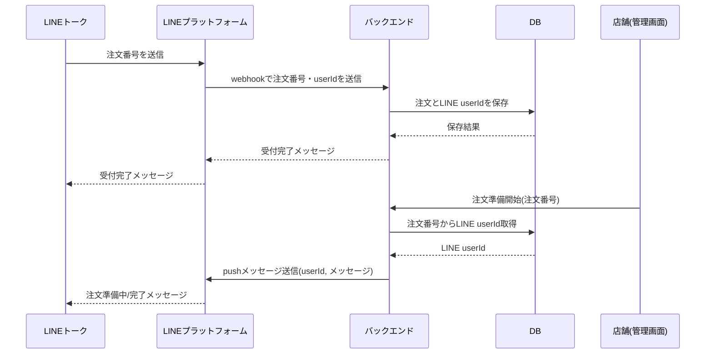
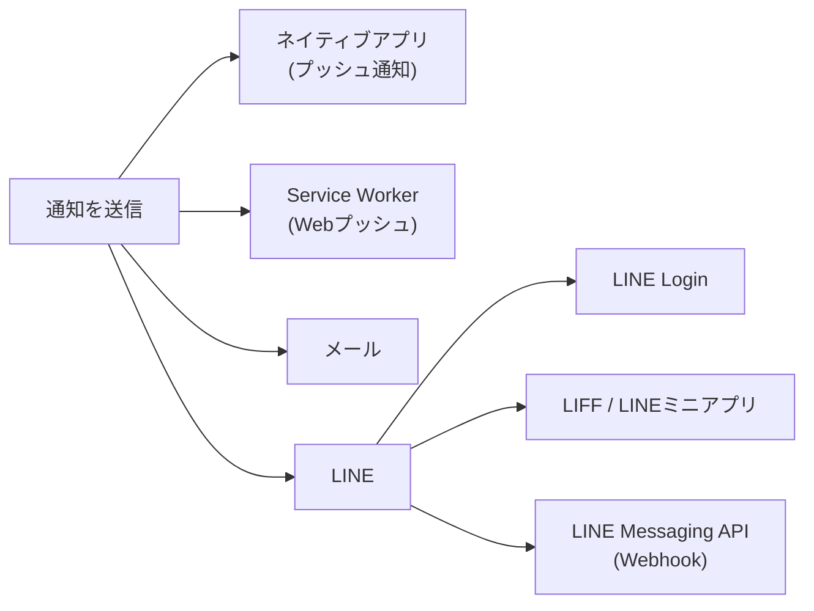

## はじめに

この記事は[team411 Advent Calendar 2025](https://adventar.org/calendars/12375)の19日目の記事です。
昨日の記事はtaragodさんの[ネイティブアプリ『SAYCRET』を作った話](https://zenn.dev/team411/articles/9a0b69d0c61562)でした。  
私は普段ウェブアプリケーションの作成ばっかりなので、同じ学生という立場でネイティブアプリを作成し、アプリストアに公開して実際に多くの方に使用されているという貴重な経験ができているのは羨ましい限りです。

さて19日目の私からはウェブアプリの「通知」についての記事です。ウェブアプリでユーザーにプッシュ通知を送信したくて悩んだ方は多いのではないでしょうか。

実は私が所属している電気通信大学の学祭にモバイルオーダーを導入する試みをしており、今年で3年目でした。
モバイルオーダーの詳細については以下のリンクに書いておきました。
https://keitaito.net/works/mo
モバイルオーダー（ウェブ）アプリを作成するにあたっては、主に注文の呼び出しで使用します。それにより遠隔から注文できたり、注文して呼び出されるまでの間他を回ることもでき、混雑緩和を始めより良い学園祭になることが期待できますね。  
この内容で[TechBarUECのLT会](https://team411.net/articles/2025-chofusai/)に登壇したのでその資料も踏まえながら書いていきます。


ちなみに使用技術は以下のようになっています。


## ウェブアプリでも通知をしたい

通知を送信したいケースでは以下のようなものを思いつきました。

- DMが届いた、投稿にコメントがついた
- 災害情報、重大ニュース
- ビルド成功、デプロイ完了、レポート生成完了
- 商品が調理開始・準備完了・発送された

通知を送信する選択肢としては以下のようなものがありますね。ただどれも中途半端なものです。

| 手段             | 私の意見                               |
| ---------------- | -------------------------------------- |
| ネイティブアプリ | メインストール・✕アプリストア          |
| Service Worker   | 制限\*が多い・iPhoneも最近対応         |
| メール           | リアルタイム感が薄い・実装もだるい     |
| LINE / Discord   | 友達になりたくない <br> 利用者数・手軽 |

今回はLINEでの通知に着目しました。

- LINE公式アカウントから自由にメッセージを送信できる
- 0.5~1円/メッセージ
- `@line/bot-sdk`などのライブラリが充実

こんな感じで簡単にメッセージを送れます。

```ts
client.pushMessage({
  to: userId,
  messages: [{ type: "text", text: "hello, world" }],
});
```

こんな感じで通知が届きます。（上記で細かいプロパティを設定してあげると）

ですが、`userId`をどうにか取得しないと、個人にメッセージを送信することはできません。`userId`を取得する方法をまとめました。


## LINEと連携する方法を検討

1. LINE Login
   OpenID Connectを利用してログインすることができます。Googleでログインなどと同じです。[ユーザープロフィールを取得する](https://developers.line.biz/ja/reference/line-login/#get-user-profile)などから`userId`を取得することができます。
   
2. LIFF / LINEミニアプリ
   LINEアプリ内で開かれるウェブアプリ（LIFFブラウザ）。`@line/liff`からimportされる関数をウェブアプリ内で実行することで、`userId`が取得できる
3. LINE Messaging API (Webhook)
   テキスト送信イベントなどを受信できる。
   `source.userId`で取得できる。
   
   _デベロッパーコンソールからwebhookを受け取るURLを指定する_

```json
{
  destination: "***",
  events: [
    {
      type: "message",
      message: {
        type: "text",
        id: "***",
        quoteToken: "***",
        markAsReadToken: "***",
        text: "こんにちは",
      },
      source: {
        type: "user",
        userId: "***",
      },
      // ...
    },
  ],
};
```

以上の3つの選択肢から、今回はLINE Messaging API (Webhook)を採用しました。以下の理由が選定理由になりました。

- LINEとウェブアプリをより疎結合にできる
  既存の実装に付け足しやすい
- 他は開発体験が悪い

## 注文の通知の実装

注文が完了後、LINEと連携することで呼び出し通知を受け取ることができるように実装しました。実際には以下の図のようなフローで、任意でLINEに通知を送信できるようにしました。

今回の学園祭では26%のモバイルオーダーでLINEと連携されていました。


このようなフローで実装したので、参考程度にしてください。



## ウェブアプリと通知の未来に期待

今回示した選択肢は以下の通りでしたが、最初に述べたようにどれも一長一短で、利用者にとっても、開発者にとっても使いやすいものが出てこないでしょうか。プッシュ通知を実装するためにネイティブアプリを作成する必要がなくなれば、よりウェブアプリ界隈が盛り上がりそうですね。



明日20日は、metomananaさんの見やすいスライドの作り方です。スライドのデザインセンスがないので、参考にさせてもらいたいです。
